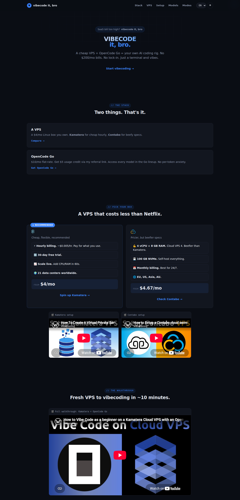
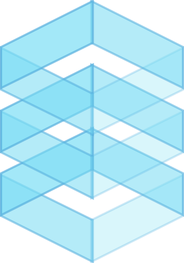
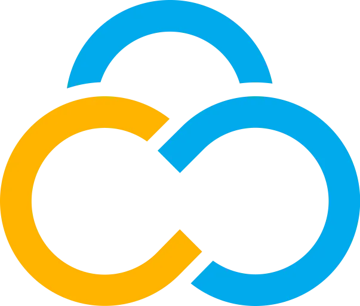

# vibecodeitbro.com

Static landing page for the **vibecode it, bro** tutorial — a cheap VPS + [OpenCode Go](https://opencode.ai/go?ref=9Q6GKAZPK6) = your own AI coding rig. No $200/mo bills. No lock-in. Just a terminal and vibes.

## Partners

&nbsp;&nbsp;
&nbsp;&nbsp;

## Features

- **[Kamatera](https://kamatera.sjv.io/c/1245219/3024352/36439) vs [Contabo](https://websplaining.com/contabo)** comparison cards with affiliate links (hourly vs monthly billing)
- **Step-by-step walkthrough**: fresh VPS to vibecoding in ~10 minutes, with screenshots and copy-paste commands
- **Live [OpenCode Go](https://opencode.ai/go?ref=9Q6GKAZPK6) model list**: fetched from `https://opencode.ai/zen/go/v1/models` via the same-origin `/api/go/models` proxy (no CORS, no stale list)
- **19 languages** with client-side i18n (RTL support for Arabic and Persian)
- **Plan vs Build** modes explainer
- Dark/light theme toggle

## Deploy

Plain static files (HTML/CSS/JS) served by nginx behind Cloudflare:

- Document root: `/var/www/vibecodeitbro.com`
- HTML served with `Cache-Control: no-cache` (always revalidated)
- Static assets versioned with query params for cache busting (`?v=N`)
- `/api/go/models` reverse-proxied to the [OpenCode Go](https://opencode.ai/go?ref=9Q6GKAZPK6) models endpoint

## Tech

- No build step, no framework — hand-written HTML/CSS/JS
- OpenGraph + Twitter Card meta tags for social previews (`assets/og/og-card.png`)

*Some links are affiliate links — we may earn a commission at no cost to you.*

© Websplaining · vibecodeitbro.com
